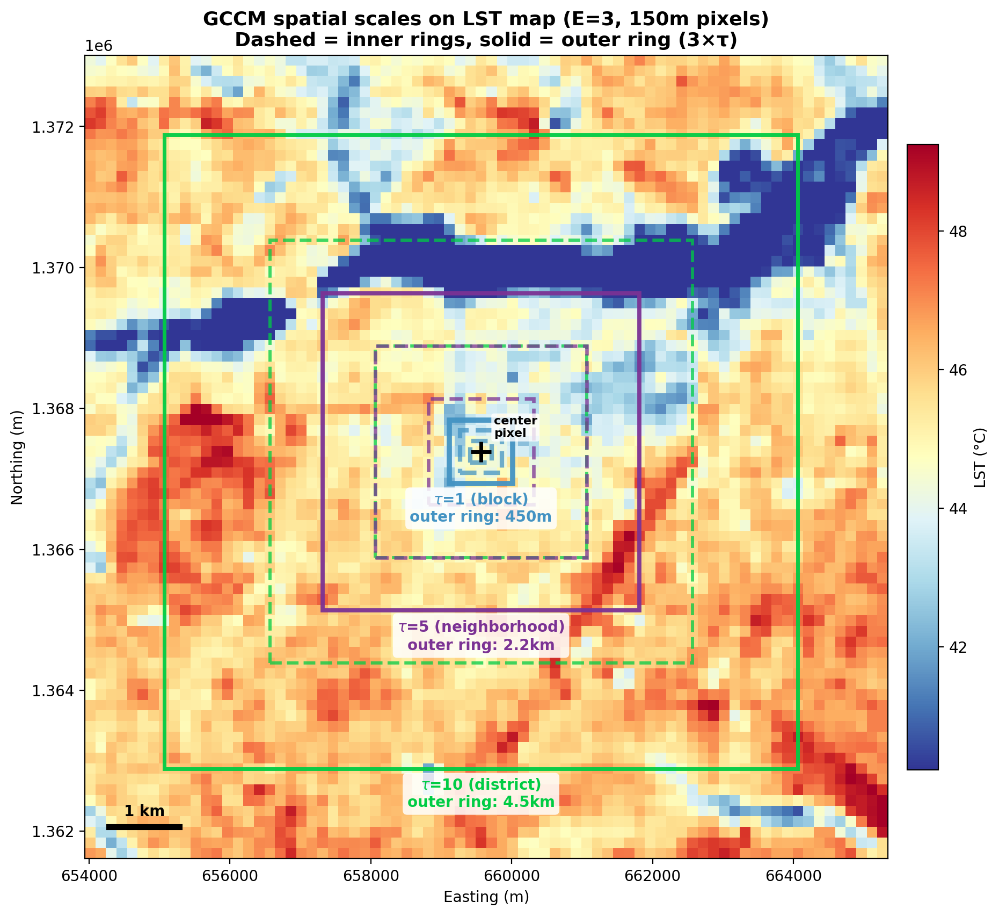
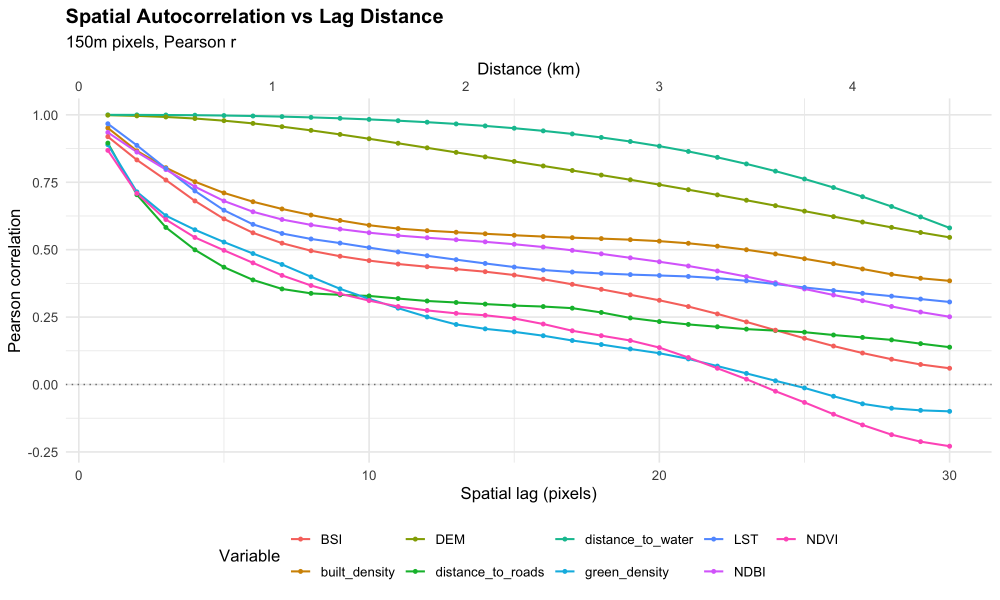

# GCCM Results: Urban Heat Drivers in Ouagadougou

## What is GCCM?

Geographical Convergent Cross Mapping (Gao et al. 2023, *Nature Communications*)
tests whether two spatial variables share underlying dynamics. It goes beyond
correlation by asking: does the spatial pattern of one variable contain enough
information to reconstruct the other?

Each pixel is described by the mean values of concentric rings around it.
If the ring-pattern of variable Y can predict variable X, that is evidence
that X influences Y's spatial structure.

We tested 8 surface properties against Land Surface Temperature (LST) in
Ouagadougou at 150m resolution (~25,000 valid pixels).

| Predictor | Source | Type |
|-----------|--------|------|
| built_density | ESA WorldCover 2021 | 90m kernel density |
| green_density | ESA WorldCover 2021 | 90m kernel density |
| distance_to_water | JRC / OSM | Static |
| distance_to_roads | OSM | Static |
| DEM | Copernicus GLO-30 | Static (control variable) |
| NDBI | Sentinel-2, 2024 Mar-May | Spectral index |
| BSI | Sentinel-2, 2024 Mar-May | Spectral index |
| NDVI | Sentinel-2, 2024 Mar-May | Spectral index |

Target: **LST** from Landsat 8/9, 2022-2024 Mar-May median (different sensor
and time window from Sentinel-2 predictors).

---

## All variables are coupled with LST

The signature of coupling in GCCM is **convergence**: prediction skill (rho)
increases as the method uses more spatial context (larger library size).
Every variable shows clear convergence in both directions across all
parameter configurations we tested.

**E=3, tau=1 (block scale, 450m reach):**

**E=3, tau=5 (neighborhood scale, 2.25km reach):**

**E=3, tau=10 (district scale, 4.5km reach):**

*Reminder: E = number of rings, tau = spacing between rings. With E=3 at
150m resolution, tau=1 uses rings at 150m/300m/450m (block scale), tau=5
uses rings at 750m/1.5km/2.25km (neighborhood scale), while tau=10 uses
rings at 1.5km/3km/4.5km (district scale).*

All three configurations show lines going up from left to right for every
variable. This convergence is the primary evidence of dynamical coupling
between each surface property and LST.

**Interpretation of convergence:**

1. **Lines going up** = convergence. This is the key test. It means that
   as the method sees more spatial context, it gets better at predicting.
   That increase is the evidence of dynamical coupling. A flat or decreasing
   line would mean no coupling.
2. **Separation between the two lines** = directional evidence. If one line
   is consistently higher, that direction has stronger cross-mapping, which
   in theory indicates causal direction. In practice, most of our variables
   show the lines close together or overlapping (see note about confidence
   intervals below).
3. **Final rho value** (right end of each line) = the coupling strength at
   the largest library size. This is the number reported in the summary tables.

**About the confidence intervals:** The shaded ribbons are 95% CIs computed
via Fisher-z transform, following Gao et al. (2023). N = 2000 prediction
points.

Where the CI ribbons for the two directions **do not overlap**, there is
statistically significant evidence that one direction is stronger. Where
they overlap, we cannot distinguish the directions.

---

## How strong is the coupling?

Our rho values are comparable to or stronger than published GCCM results:

**Published benchmarks (Gao et al. 2023, global/regional scales):**

| Variable pair | rho (X causes Y) | rho (Y causes X) |
|---------------|------------------|------------------|
| Elevation causes Population | ~0.64 | ~0.36 |
| Precipitation causes NPP | 0.37-0.83 | varies |
| Temperature causes NPP | 0.17-0.50 | varies |

**Published benchmarks (Yeboah et al. 2025, GCCM on LULCC in Chongqing):**

| Variable pair | rho (X causes UHI) |
|---------------|--------------------|
| Built-up causes UHI | 0.32-0.63 |
| Bare land causes UHI | 0.25-0.42 |
| Vegetation, waterbodies cause UHI | negative (cooling) |

Gao's benchmarks are at coarse resolution (county/global scale). Yeboah's
are at 30m Landsat resolution, closer to our 150m setup, making them a more
direct comparison. Our values are comparable or stronger across the board.

**Our results (E=3, tau=1):**

| Predictor | rho (pred causes LST) | rho (LST causes pred) |
|-----------|-------------------|-------------------|
| NDBI | 0.73 | 0.73 |
| BSI | 0.71 | 0.72 |
| NDVI | 0.51 | 0.50 |
| built_density | 0.49 | 0.21 |
| DEM | 0.44 | 0.45 |
| distance_to_water | 0.40 | 0.45 |
| green_density | 0.34 | 0.16 |
| distance_to_roads | 0.25 | 0.18 |

**Our results (E=3, tau=5):**

| Predictor | rho (pred causes LST) | rho (LST causes pred) |
|-----------|-------------------|-------------------|
| distance_to_water | 0.61 | 0.42 |
| NDBI | 0.51 | 0.52 |
| DEM | 0.51 | 0.46 |
| BSI | 0.46 | 0.51 |
| built_density | 0.43 | 0.41 |
| NDVI | 0.28 | 0.24 |
| green_density | 0.23 | 0.24 |
| distance_to_roads | 0.23 | 0.22 |

**Our results (E=3, tau=10):**

| Predictor | rho (pred causes LST) | rho (LST causes pred) |
|-----------|-------------------|-------------------|
| distance_to_water | 0.57 | 0.52 |
| DEM | 0.48 | 0.49 |
| NDBI | 0.47 | 0.45 |
| built_density | 0.42 | 0.41 |
| BSI | 0.42 | 0.42 |
| NDVI | 0.31 | 0.19 |
| green_density | 0.25 | 0.22 |
| distance_to_roads | 0.18 | 0.18 |

All values are statistically significant (p < 0.05). The 95% CIs, computed
via Fisher-z transform with N = 2000 prediction points following Gao et al.
(2023), exclude zero for all variables in both directions.

---

## Can we determine causal direction?

GCCM tests direction by comparing forward rho (pred causes LST, measured by
LST cross-mapping pred) vs reverse rho (LST causes pred, measured by pred
cross-mapping LST). If one direction is significantly stronger, that suggests
causal direction.

The bar chart below shows forward and reverse rho for each variable, with
the asymmetry (difference) annotated. Green = pred causes LST (expected
direction), red = LST causes pred.

*Labels: (C) = temporally independent predictors (WorldCover, OSM, DEM;
acquired independently from LST). (A) = spectral indices (Sentinel-2, 2024
Mar-May; different sensor and partially different time window from Landsat
LST 2022-2024 Mar-May, but both capture similar seasonal conditions).
All three panels use fixed E=3; only tau differs.*

Most asymmetries are small, and the ranking changes across panels.
built_density goes from the strongest positive asymmetry (+0.29) at tau=1 to
nearly zero (+0.01) at tau=10. distance_to_water shows the strongest signal
at tau=5 (+0.19), where it clearly separates from the pack. DEM (our control
variable, known direction: DEM causes LST) shows the wrong sign at tau=1 and
tau=5, but is near zero at tau=10.

---

## Results are sensitive to parameter choices (E and tau)

We ran four configurations for all 8 variables to test how the choice of
embedding dimension (E) and spatial lag (tau) affects the results. Comparing
adjacent configs isolates one parameter at a time:

- **E=3/tau=1 vs E=3/tau=5 vs E=3/tau=10**: tau effect (E held constant)
- **E=3/tau=10 vs simplex-E/tau=10**: E effect (tau held constant)

Same data, colored by predictor to trace individual variables across configs:

**Left panel (coupling strength):** Rho values shift across configs, but
all variables remain significantly coupled with LST in every configuration.
Coupling is robust to parameter choice.

**Right panel (asymmetry):** The directional signal is not stable. For example,
built_density has asymmetry +0.29 at E=3/tau=1 (strongly "pred causes LST"),
but flips to -0.06 at simplex-E/tau=10. green_density similarly flips from
+0.18 to -0.08. DEM, our control variable (known direction: DEM causes LST),
only shows the correct positive asymmetry in the simplex-E/tau=10 config.

| Predictor | E=3, tau=1 |  | E=3, tau=5 |  | E=3, tau=10 |  | simplex E, tau=10 |  |
|-----------|:---:|:---:|:---:|:---:|:---:|:---:|:---:|:---:|
| | fwd | asym | fwd | asym | fwd | asym | fwd | asym |
| DEM | 0.44 | -0.01 | 0.51 | +0.05 | 0.48 | -0.01 | 0.72 (E=9) | +0.10 |
| distance_to_water | 0.40 | -0.05 | 0.61 | +0.19 | 0.57 | +0.05 | 0.71 (E=9) | +0.05 |
| NDBI | 0.73 | -0.00 | 0.51 | -0.01 | 0.47 | +0.03 | 0.68 (E=10) | +0.01 |
| built_density | 0.49 | +0.29 | 0.43 | +0.02 | 0.42 | +0.01 | 0.64 (E=12) | -0.06 |
| BSI | 0.71 | -0.01 | 0.46 | -0.05 | 0.42 | -0.01 | 0.64 (E=11) | -0.03 |
| NDVI | 0.51 | +0.01 | 0.28 | +0.04 | 0.31 | +0.12 | 0.57 (E=10) | +0.07 |
| distance_to_roads | 0.25 | +0.07 | 0.23 | +0.01 | 0.18 | -0.00 | 0.55 (E=12) | -0.03 |
| green_density | 0.34 | +0.18 | 0.23 | -0.00 | 0.25 | +0.03 | 0.50 (E=10) | -0.08 |

*fwd = rho (pred causes LST). asym = fwd minus rev (positive = expected direction).*

**Key takeaway:** Coupling (are these variables linked to LST?) is robust
across all parameter choices. Direction (which drives which?) is not.

---

## Why direction is hard at this resolution

The plot below shows Pearson correlation between each variable and a
spatially shifted copy of itself, as a function of distance (in pixels,
where 1 pixel = 150m). For each variable: how similar is a pixel's value
to pixels 1, 2, 3, ... steps away? A value of 1.0 means identical, 0.0
means no relationship. This is a property of the data, independent of GCCM.

The x-axis is lag distance in pixels, which maps directly onto GCCM's tau
parameter: when tau=1, GCCM uses rings at lags 1, 2, 3 (read off the left
side of the plot where autocorrelation is highest). When tau=10, the rings
are at lags 10, 20, 30 (further right, where autocorrelation has dropped).

At lag=1 (150m), all variables have r > 0.87. This means neighboring pixels
carry nearly the same information. With tau=1, the three rings at 150m,
300m, and 450m are all highly redundant. Both the forward and reverse
cross-mapping directions can achieve high rho simply because nearby spatial
structure is so predictable, not because of a causal signal.

This is a known limitation of CCM-family methods: when coupling is strong,
both directions become significant, and the small difference between them is
sensitive to parameter choices (Ye et al. 2015).

No published GCCM study has been conducted at sub-km resolution, so there is
no established benchmark for how directional asymmetry should behave at this
spatial scale.

---

## Simplex selection of E

The standard EDM approach is to let simplex projection choose E automatically:
try E=2, 3, ... 15 and pick whichever gives the best nearest-neighbor prediction
skill. In temporal data from chaotic systems, prediction skill peaks at the true
system dimension and then declines and that peak is meaningful.

In spatially autocorrelated raster data, this might not be meaningful.
Each additional ring adds a tiny bit of extra information (redundant but
not perfectly so), so prediction skill keeps climbing with no peak. Simplex
just returns whatever the maximum of the search range is.

Each panel shows one tau value. Lines = simplex prediction skill (rho) at
each E. Stars = the "best" E that simplex selected. Dashed gray = E=3 (our
fixed choice).

- **tau=1:** DEM and LST flatten early (E=3-4), but BSI still climbs to E=15.
- **tau=3:** All four variables climb monotonically — every one maxes out
  at E=15.
- **tau=5:** Same pattern — 3 of 4 hit E=14-15.
- **tau=10, 15:** Curves show more diminishing returns, but still no clean peak.

These are likely not meaningful dimensionality estimates, since simplex is
chasing marginal interpolation gains in spatial data.

**This matters for our GCCM:** At high E (9-15) and high tau, each pixel's
state vector captures a huge chunk of the city. Both the LST cloud and
predictor cloud end up encoding the same city-wide gradient, so
cross-mapping works equally well in both directions and the asymmetry signal
disappears. At E=3, the clouds encode more local spatial structure where
causal differences can emerge.

We fix E=3 following Gao et al. (2023), who used E=2-3 in their published
examples.

The choice of E and tau for future analyses should probably be more
theoretically driven, as opposed to data driven, where chosen E and tau are
based on what geographic extent we want to cover and what we assume should
be the relevant extent of influence of a feature (e.g. maybe green spaces
have very local extent of influence occuring on the scale of 1-100 meters,
while DEM has a much wider extent of influence on LST occuring on 100-1000
meters).

For example, tau=3 with E=8 gives 8 rings spaced 450m apart, spanning from
450m to 3.6km — covering block-to-neighborhood scale variation with finer
spatial resolution than tau=10/E=3, while sampling a comparable total extent.

A configuration like this could be a reasonable theoretically-motivated
starting point: the inner rings capture local effects (e.g. park cooling
within a few blocks) while the outer rings pick up neighborhood-scale
structure (e.g. proximity to the reservoir), all without collapsing into
a single city-wide gradient the way high-E/high-tau combinations do.

Unfortunately, this configuration wasn't run yet. 🙈

---

## What we can conclude

**Robust findings (consistent across all parameter configurations):**

- All 8 surface properties show significant dynamical coupling with LST
- Coupling strength is comparable to published GCCM benchmarks
- The built environment (built_density, distance_to_roads, distance_to_water)
  is genuinely linked to the temperature field, beyond simple correlation
- Spectral indices (NDBI, BSI) show the strongest coupling with LST

**Open questions:**

- Causal direction cannot be reliably determined at 150m resolution
- The method has not been validated at sub-km scales in the literature

**Multi-scale analysis with fixed E=3 and varying tau.**
Fixing E=3 (matching Gao's protocol) removes one source of instability, while
varying tau lets us ask at which spatial scale each variable most strongly
drives LST. Each tau corresponds to a real urban scale:

| Config | Ring distances | Outer reach | Urban meaning | Status |
|--------|---------------|-------------|---------------|--------|
| tau=1, E=3 | 150m, 300m, 450m | 450m | ~1-2 city blocks | Done |
| tau=5, E=3 | 750m, 1.5km, 2.25km | 2.25km | Neighborhood | Done |
| tau=8, E=3 | 1.2km, 2.4km, 3.6km | 3.6km | Large neighborhood / small district | Planned |
| tau=10, E=3 | 1.5km, 3km, 4.5km | 4.5km | District | Done |

At tau=5, distance_to_water shows the strongest asymmetry of any variable
in any configuration (+0.19), suggesting water proximity may exert its
strongest causal influence at the neighborhood scale. However, the DEM
control also shows positive asymmetry (+0.05) at tau=5, meaning directional
results at this scale should be interpreted with caution.

---

## References

- Gao, B. et al. (2023). Causal inference from cross-sectional earth system data with geographical convergent cross mapping. *Nature Communications*, 14, 5875.
- Ye, H. et al. (2015). Distinguishing time-delayed causal interactions using convergent cross mapping. *Scientific Reports*, 5, 14750.
- Lyu, W. (2026). spEDM: Spatial Empirical Dynamic Modeling. R package. doi:10.32614/CRAN.package.spEDM
- Yeboah, E. et al. (2025). A causal investigation of land use and land cover change on emerging urban heat island footprints in a mid-latitude region. *Environment, Development and Sustainability*.
